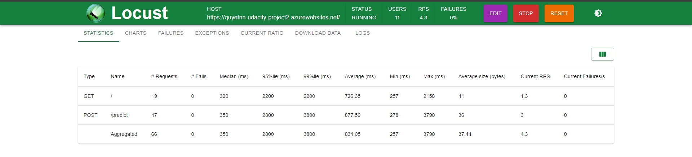

[](https://github.com/quyetnn1102/udacity-azure-devops-project2/actions/workflows/python-app.yml)
# Overview

In this project, you will build a Github repository from scratch and create a scaffolding that will assist you in performing both Continuous Integration and Continuous Delivery. You'll use Github Actions along with a Makefile, requirements.txt and application code to perform an initial lint, test, and install cycle. Next, you'll integrate this project with Azure Pipelines to enable Continuous Delivery to Azure App Service.

## Project Plan
It is very important to have a project plan and task tracking so in this project we will use Excel spreadsheet and Trello:

* [Trello Board](https://trello.com/b/iZRpZVWd/udacity-azure-devops-building-ci-cd-pipeline)
    
* [Project Plan](https://github.com/quyetnn1102/udacity-azure-devops-project2/blob/00fbe25748ecfdd474f84583fada82a37c0d1958/Azure-Devops-CICD-project-plan.xlsx)

## Instructions


### 2.1.	Configuring GitHub
- Log into Azure Cloud Shell
- Create a ssh key

```bash
ssh-keygen -t rsa -b 2048 -C "yourgithub_Id@gmail.com"
```


Copy the public key to your GitHub Account -> Settings -> SSH and GPG keys (https://github.com/settings/keys)

### 2.2.	Clone code
Once SSH Key configured in Github then clone project into Azure Cloud Shell 
```bash
git clone git@github.com:quyetnn1102/udacity-azure-devops-project2.git
```


### 2.3.	Create a Python Virtual Environment to run your application

```bash
make setup
```


And then activate the virtual environment
```bash
source ~/.udacity-azure-devops-project2/bin/activate
```


Run following command to install project dependencies
```bash
make all
```


Run Application and make a test using below command

Run application
```bash
export FLASK_APP=app.py
	flask run
```


Make a prediction test
```bash
sh make_prediction.sh
```


### 2.4.	Deploy the application to Azure App Service
Now time to deploy the application to Azure App Service using below command which already written up to `commands.sh`
```bash
az webapp up -n quyetnn-udacity-project2 -g Azuredevops --sku FREE
```


Make a prediction test for deployed app running on Azure App Services
```bash
sh make_predict_azure_app.sh
```


Output of streamed log files from deployed application in Azure App Service 
```bash
az webapp log tail --name quyetnn-udacity-project2 --resource-group Azuredevops
```


### 2.5.	Setup GitHub Action
Set up the CI pipeline with GitHub Actions and below is the result when push a change to the repository:


### 2.6.	Setup Azure Pipelines
Setup Azure Pipelines to continue deploy application to Azure App Services follow these instructions from Azure [Azure pipeline python app instructions](https://docs.microsoft.com/en-us/azure/devops/pipelines/ecosystems/python-webapp?view=azure-devops) and [Azure pipeline self hosted agent](https://learn.microsoft.com/en-us/azure/devops/pipelines/agents/linux-agent?view=azure-devops)


### 2.2.	Load testing using Locust

- Install locust
```bash
pip install locust
```

Move to directory contains `locustfile.py` before run command:
```bash
locust
```
Open Locust app http://localhost:8089/ then config test with your deployed host `https://quyetnn-udacity-project2.azurewebsites.net/`


The output test



## Enhancements

The project can be configured to work with GitFlow, so if you commit to a particular branch, the code can continue to be deployed in the corresponding environment (DEV, QA, Staging or PROD).

## Demo 

<TODO: Add link Screencast on YouTube>


